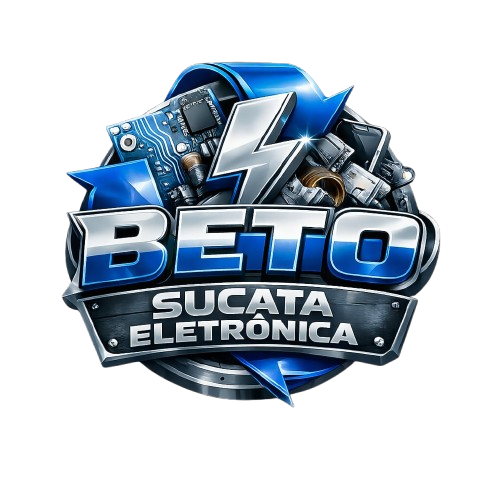

# Beto Sucata Eletrônica - Landing Page Premium

Site institucional moderno e responsivo desenvolvido para a **Beto Sucata Eletrônica LTDA**. O projeto destaca a liderança em reciclagem, o compromisso com a economia circular e a preservação ambiental em Aparecida de Goiânia - GO.



## 🚀 Tecnologias Utilizadas

- **React 19**: Biblioteca principal para construção da interface.
- **Vite**: Ferramenta de build ultra-rápida.
- **Framer Motion**: Animações fluidas e interações premium.
- **Lucide React**: Biblioteca de ícones modernos e leves.
- **Vanilla CSS**: Estilo personalizado com foco em alta performance e design "Eco-Industrial".

## ✨ Funcionalidades

- **Design Responsivo**: Adaptado para Desktop, Tablet e Mobile.
- **Integração WhatsApp**: Botões de ação direta para orçamentos rápidos.
- **Mosaico Sustentável**: Seção de legado baseada no estilo "Bento Grid".
- **Localização 3D**: Ícone de localização animado em 3D sobre seu próprio eixo.
- **Modo Escuro Premium**: Paleta de cores baseada em Azul Elétrico e Cromo.
- **Mapa Interativo**: Integração com Google Maps para fácil localização da sede.

## 🛠️ Instalação e Execução Local

1. Clone o repositório:
   ```bash
   git clone https://github.com/devjohnnydev/Beto_GO.git
   ```

2. Entre no diretório:
   ```bash
   cd Beto_GO
   ```

3. Instale as dependências:
   ```bash
   npm install
   ```

4. Execute o servidor de desenvolvimento:
   ```bash
   npm run dev
   ```

5. Para gerar o build de produção:
   ```bash
   npm run build
   ```

## ☁️ Hospedagem (Railway)

Este projeto está configurado para ser hospedado no **Railway**.
- O script `start` automático utiliza o `vite preview` na porta especificada pelo ambiente.
- Caso prefira um servidor estático (static sites), o Railway detectará automaticamente o build do Vite.

## 📁 Estrutura do Projeto

```text
src/
├── assets/           # Imagens, logotipos e ícones customizados
├── components/       # Componentes React (Navbar, Hero, About, etc.)
├── App.jsx           # Componente principal e orquestração de filtros
└── index.css         # Estilos globais e tokens de design
```

## 👤 Desenvolvido por
**Beto Sucata Eletrônica LTDA**
*Aparecida de Goiânia - GO*
